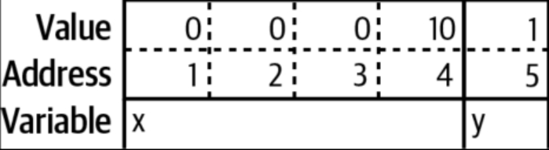
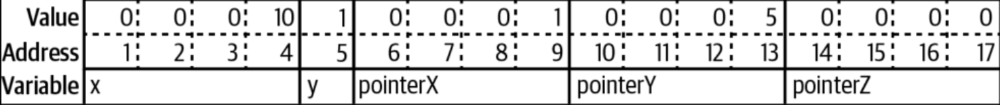

# Pointers

---

- [Quick Pointer Primer](#quick-pointer-primer)
- [Pointers Behavior Like Classes](#pointers-behavior-like-classes)
- [Pointers Indicate Mutable Parameters](#pointers-indicate-mutable-parameters)

---

## Quick Pointer Primer

- *Pointer* - A variable that holds the memory location (memory address) of where a value is stored
- Variables are stored in one or more contiguous memory locations (addresses)
  - Different variable types can take different number of memory addresses
  - Depending on the size of the type
  - **The smallest amount of addressable memory is a byte**

```go
var x int32 = 10
var y bool = true
```



- **A pointer is a variable that contains the address of another variable**
  - Holds a number that indicates the memory location where the data is stored
  - This number is the *Address*

```go
var x int32 = 10
var y bool = true
var pointerX *int32 = &x
pointerY := &y
var pointerZ *string
```



- **Every pointer is always occupying the same (fixed) number of memory locations**
  - Regardless of the type it is pointing to
  - In the example, we are using 4 bytes
  - **In modern computer, it is usually 8 bytes**
  - In Go, the size of a pointer variable is:
    - 8-bytes for 64-bit machines
    - 4-bytes for 32-bit machines
- ***Zero-Value of a Pointer: `nil`***
  - `nil` is untyped identifier
  - Represents lack of value
  - Not another name for `0` (unlike in C)
  - Defined in the *Universe* block
    - *Can be shadowed*
    - *Never name variables `nil`*
- *Slice*, *Map*, *Function* are implemented using Pointers
  - Which is why their zero-values are the same
  - *Channel* and *Interface* are also implemented using Pointers
- **Go's pointer syntax is partially borrowed from C/C++**
  - But without painful memory management: Go is Garbage-Collected
  - Some pointer features in C/C++ are not allowed (E.g. *Pointer Arithmetics*)
- *NOTE: Go has `unsafe` package for low-level operations*
  - But it is exceedingly rare to use `unsafe`
- **`&` is the *Address Operator***
  - Precedes a value-type variable
  - Returns the address where the value of that variable is stored
- **`*` is the *Indirection Operator***
  - Precedes a pointer-type variable
  - Returns the pointed value
  - **This is called *Dereferencing* the pointer**
  - **However, when used on a *type* instead of a variable, it denotes a *Pointer-Type* to that type**

```go
// Pointer Operators
// -----------------
var x int32 = 10         // Value-type int32
var pointerX *int32 = &x // Pointer-type to a type int32

fmt.Println("pointerX =", pointerX)   // Prints the memory address: 0xc000012128
fmt.Println("*pointerX =", *pointerX) // Prints the pointed value: 10
```

- **WARNING: Before dereferencing a pointer, make sure that it is not `nil`**
  - Attempting to dereference a `nil` pointer results in a panic

```go
var x *int              // nil pointer
fmt.Println(x == nil)   // true
fmt.Println(*x)         // panic
```

- *Pointer Type*
  - A type that represents a pointer
  - Written with a `*` before the type name
  - Can be based on any type

```go
x := 10
var pointerX *int
pointerX = &x
```

- **Built-in function `new()` creates a pointer variable**
  - Returns a pointer to a zero-value instance of the type
  - But `new()` is rarely used

```go
var x = new(int)        // Returns a pointer to 0
fmt.Println(x == nil)   // false
fmt.Println(*x)         // 0
```

- For struct, use `&` before the struct literal
- **Cannot use `&` on primitive literals or constants**
  - They do not have memory address
  - Exist only at compile time
  - *If pointer is needed for them, declare a variable instead*

```go
x := &Foo{} // Struct pointer
var y string
var z int
ptrY := &y  // String pointer
ptrZ := &z  // Integer pointer
```

- Not being able to get the address of a constant is sometimes inconvenient
  - Cannot assign literals directly to pointer-type fields

```go
type Person struct {
    FirstName   string,
    MiddleName  *string,
    LastName    string,
}

p := Person{
    FirstName: "John",
    MiddleName: "Edler", // Does not work
    LastName: "Smith",
}

p := Person{
    FirstName: "John",
    MiddleName: &"Edler", // Does not work
    LastName: "Smith",
}
```

- 2 ways to solve this:
  - *1. Introduce a variable to hold the constant value*
  - *2. Write a generic helper function: Takes a param of any type and return a pointer to that type*

```go
// Generic Pointer helper
func makeConstPtr[T any](t T) *T {
    return &t
}

p := Person{
    FirstName: "John",
    MiddleName: makeConstPtr("Edler"), // This works!
    LastName: "Smith",
}
```

- The constant is copied to the function as variable (param)
- Variables have memory address

## Pointers Behavior Like Classes

- Pointers might look intimidating
- But they are actually the familiar behavior for classes in other languages
- **In other languages, there is a behavior difference between primitives and classes**
  - When primitives are assigned to another variable (aliased), change made to the other variable are not reflected
  - The aliases do not share the same memory

```py
# Python
x = 10
y = x
y = 20
print(x) # prints 10
```

- This is not the case when an instance of a class is done the same
  - Change in one variable also affect the other

```py
# Python
class Foo:
    def __init__(self, x):
        self.x = x


def outer():
    f = Foo(10)
    inner1(f)
    print(f.x)
    inner2(f)
    print(f.x)
    g = None
    inner2(g)
    print(g is None)


def inner1(f):
    f.x = 20


def inner2(f):
    f = Foo(30) # New instance: Local scope


outer()
# 20
# 20
# True
```

- The following scenario is true in other languages
  - Pass an instance of a class to a function and change the value of a field
    - **The change is reflected in the variable that was passed in**
  - Reassign the parameter in the function
    - **The change is *not* reflected in the variable that was passed in**
  - Pass `nil`/`null`/`None` for a parameter value: Setting the parameter itself to a new value
    - **Does not modify the variable in the calling function**
- This is often explained that in other languages, *class instances are passed by reference*
  - **But that is not true**
  - Else, scenario 2 and 3 above would affect the variable
  - *They are always pass-by-value, just as in Go*
- **However, every instance of a class in these languages are implemented as Pointer**
  - Class instance passed to a function => The copied value is the *Pointer*
  - Changes made to one is reflected to the other (E.g. `f` above)
  - **Re-assigning a new instance creates a separate instance/local variable (separate memory address)**
- **The same behavior applies when using *Pointer Variables* in Go**
  - But Go gives the choice to use pointers or values for both primitives and structs
  - Most of the time, use values
    - Make it easier to understand how and when the data is modified
    - Also reduces the work of the Garbage Collector

## Pointers Indicate Mutable Parameters
